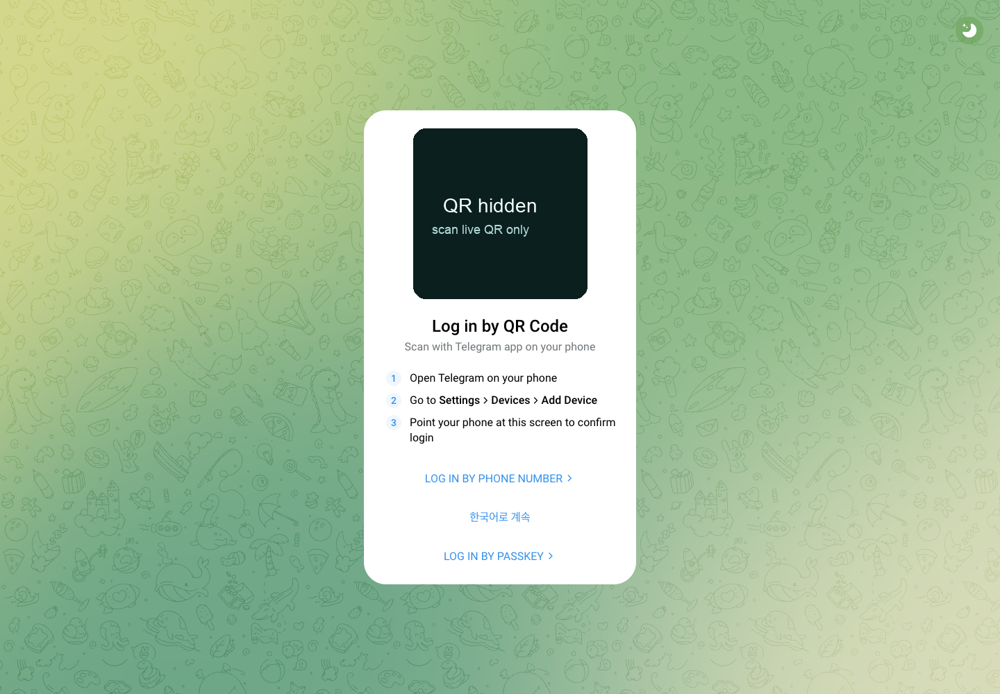
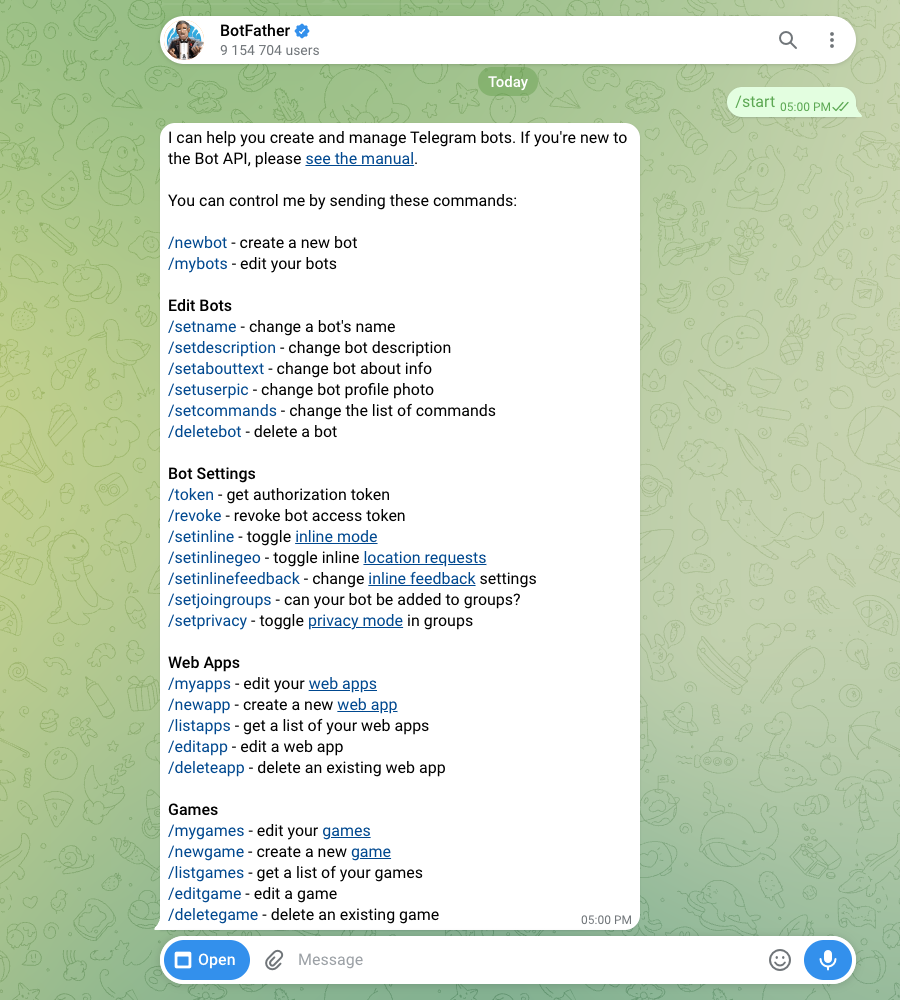
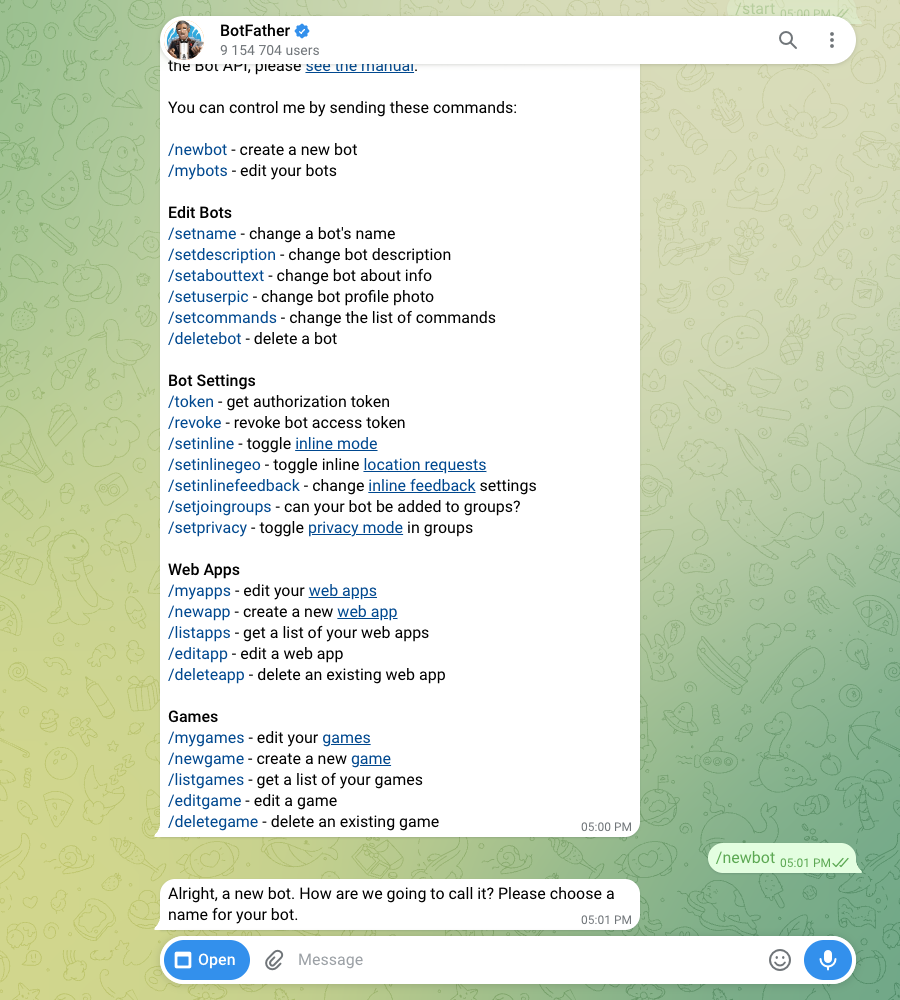
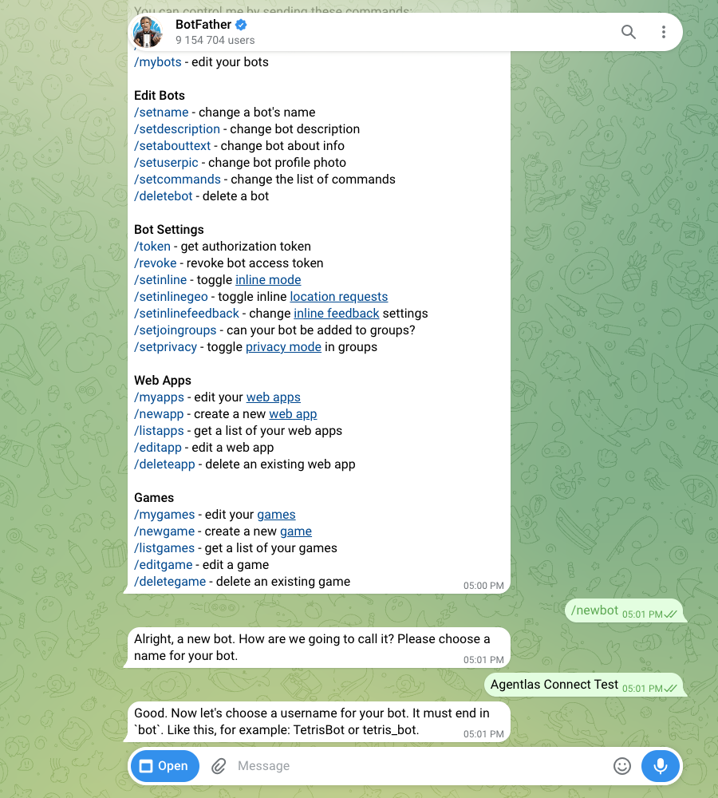
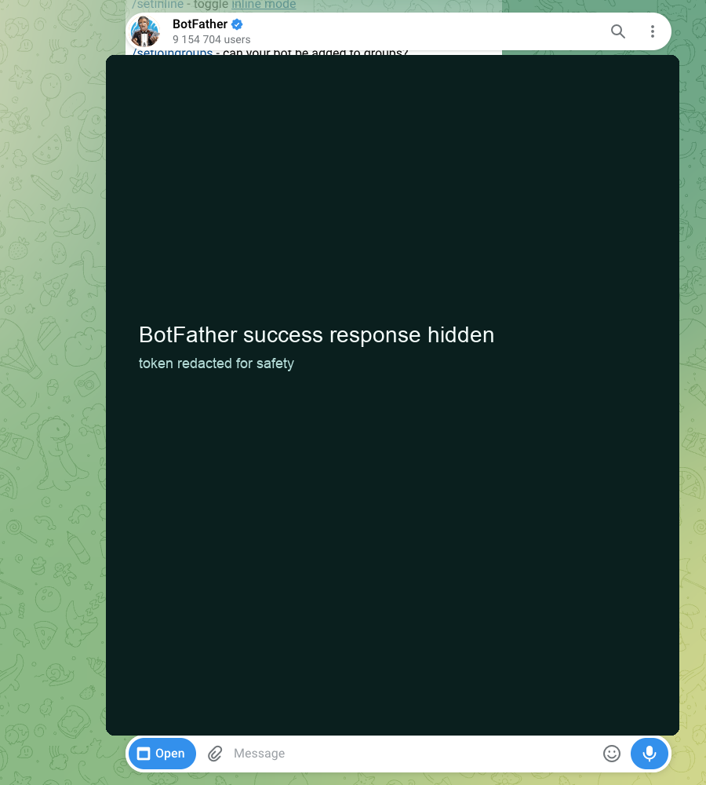
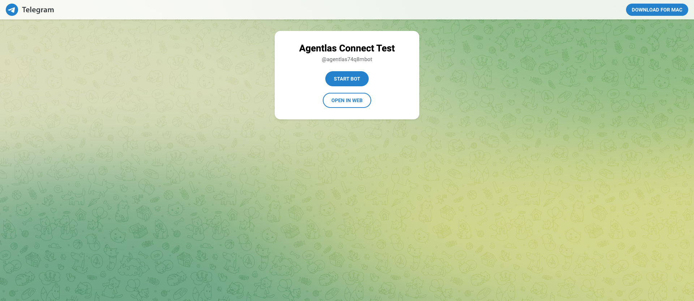

# Telegram BotFather Real Test Guide

검증일: 2026-07-04

실제 테스트 결과:

- Telegram Web에서 `@BotFather`를 열었다.
- `/newbot`을 보냈다.
- 봇 표시 이름으로 `Agentlas Connect Test`를 입력했다.
- 봇 username으로 `agentlas74q8mbot`을 입력했다.
- 공개 URL `https://t.me/agentlas74q8mbot`가 HTTP 200으로 열리고, 페이지에 `Agentlas Connect Test`와 `agentlas74q8mbot`이 확인됐다.
- BotFather가 발급한 토큰은 캡처와 문서에 남기지 않았다.
- 공개 봇 페이지도 열어 실제 생성 여부를 확인했다.

## 초등학생도 가능한 순서

### 1. Telegram Web을 연다

로그인되어 있지 않으면 QR 화면이 나온다. 휴대폰 Telegram 앱에서 QR을 스캔한다.



### 2. BotFather를 연다

주소창에 아래 주소를 입력한다.

```text
https://web.telegram.org/k/#@BotFather
```

BotFather 화면이 열리면 준비 완료다.



### 3. 새 봇 만들기를 시작한다

메시지 칸에 아래처럼 입력하고 Enter를 누른다.

```text
/newbot
```

BotFather가 봇 이름을 물어본다.



### 4. 봇 이름을 입력한다

사람이 보는 이름이다. 쉬운 이름을 입력한다.

```text
Agentlas Connect Test
```

### 5. 봇 username을 입력한다

username은 영어/숫자/밑줄만 쓰고, 반드시 `bot`으로 끝나야 한다.

```text
agentlas74q8mbot
```

이미 누가 쓰는 이름이면 BotFather가 다시 입력하라고 한다. 그때는 숫자를 조금 바꿔 다시 보낸다.



### 6. 토큰을 복사한다

성공하면 BotFather가 긴 비밀문자를 준다. 이것이 bot token이다.

중요:

- 토큰은 비밀번호다.
- 문서, 채팅, 캡처에 남기지 않는다.
- Agentlas에서는 반드시 비밀 금고 또는 Keychain에만 저장해야 한다.



### 7. 봇이 실제로 생겼는지 확인한다

아래 주소를 열어본다.

```text
https://t.me/agentlas74q8mbot
```

페이지가 열리면 BotFather에서 봇 생성이 끝난 것이다.



### 8. Agentlas에서 연결한다

수동 연결은 fallback이다. 제품의 기본 흐름은 “연결 에이전트가 대신 하고, 사용자는 로그인만”이어야 한다.

1. 왼쪽에서 답할 에이전트 또는 팀을 고른다.
2. 연결 에이전트 부르기를 누른다.
3. Agentlas가 Telegram Web과 BotFather 화면을 연다.
4. 사용자는 Telegram 로그인만 직접 한다.
5. 연결 에이전트가 `/newbot`, 봇 이름, username 입력을 대신 한다.
6. BotFather가 준 토큰은 화면에 남기지 않고 Agentlas 비밀 금고에만 저장한다.
7. 연결 에이전트가 봇을 채팅방에 넣는 방법을 보여주고 테스트 메시지를 보낸다.
8. Agentlas가 답하면 켜짐 상태가 된다.

## 자동 연결 에이전트가 해야 하는 일

사용자에게 보이는 약속은 단순해야 한다.

```text
사용자는 로그인만 합니다.
나머지는 연결 에이전트가 대신 합니다.
```

내부 동작은 아래 순서로 닫는다.

1. 선택한 대상과 Telegram 채팅방 연결 초안을 만든다.
2. Telegram Web을 연다.
3. 사용자가 로그인할 때까지 기다린다.
4. BotFather에 `/newbot`을 보내고 봇 이름과 username을 입력한다.
5. 토큰을 읽는 즉시 Keychain/vault에 저장하고 화면 로그에는 남기지 않는다.
6. 봇 공개 페이지가 열리는지 확인한다.
7. 개인방 또는 그룹방 연결을 만든다.
8. `테스트` 메시지 왕복이 성공하면 켜짐으로 바꾼다.
9. 실패하면 “로그인 필요”, “username 다시 입력”, “봇을 방에 넣어주세요”, “테스트 응답 실패”처럼 아이도 이해할 수 있는 문장으로 보여준다.

보안 기본값:

- Telegram 비밀번호와 2단계 인증 코드는 사용자가 직접 입력한다.
- Bot token은 문서, 화면 캡처, 채팅 로그에 남기지 않는다.
- 그룹방 첫 연결은 `@봇이름`으로 부를 때만 답하게 한다.
- “이 방의 모든 메시지 읽기”는 고급 설정에서 별도 승인으로 켠다.

## 그룹방에서 헷갈리지 않게 하는 기본값

Telegram 그룹방에서는 처음부터 모든 말을 봇이 읽게 만들면 위험하고 시끄러울 수 있다.

그래서 초보자 기본값은 이렇게 둔다.

```text
@봇이름 을 부르면 답한다.
```

예시:

```text
@agentlas74q8mbot 이번 광고 문구 정리해줘
```

나중에 고급 설정에서 “이 방의 모든 메시지 읽기”를 켤 수 있게 한다. 이때는 BotFather의 `/setprivacy` 설정을 바꿔야 하므로, 초보자 첫 연결에서는 숨긴다.

## 제품 UX에 반영해야 할 문구

버튼:

```text
연결 에이전트 부르기
```

단계:

```text
왼쪽에서 하나 고르기
연결 에이전트 부르기
사용자는 Telegram 로그인만
봇 만들기와 비밀문자 저장은 자동
테스트 통과하면 켜짐
```

상태:

```text
초안 -> 봇 확인 -> 방 연결 -> 테스트 성공 -> 켜짐
```

## 아직 남은 구현

이번 테스트는 BotFather 실제 생성 흐름까지 검증했다. Agentlas 쪽 실제 메시지 왕복을 끝내려면 아래 구현이 더 필요하다.

- 토큰을 Keychain/vault에 저장하는 API
- Telegram chat id를 저장하는 binding 테이블
- Telegram webhook 또는 long polling worker
- `chat id -> Agentlas target` 라우팅
- 테스트 메시지 왕복 확인
- 토큰 revoke/rotate UX
- 그룹방 privacy mode 선택 UX: 기본은 `@봇이름` 호출, 고급에서 전체 메시지 읽기
