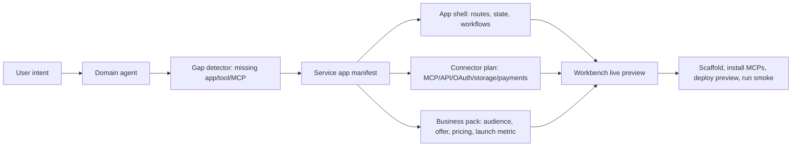
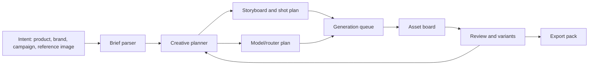
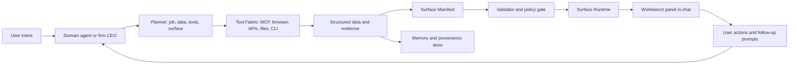

# Agentlas Agent OS: Interactive Surfaces Architecture

Date: 2026-05-31
Status: product architecture proposal
Scope: Agentlas Desktop first, web marketplace later

## Thesis

Agentlas should not compete as another chat wrapper. The winning product
surface is an Agent OS: domain agents can decide what tools and interactive
surfaces they need, assemble them from safe primitives, and show users a working
mini-application inside the conversation.

The user should not only read "here are hotels." They should see hotel cards,
maps, flight options, filters, cost breakdowns, booking links, and follow-up
actions. The same pattern applies to research reports, finance, legal, labor,
accounting, tax, ecommerce, orders, and every other vertical.

The stronger version is more ambitious than "pretty reporting": an Agentlas
agent should sometimes create the actual service app it needs. A travel agent
should not stop at a hotel table; it should be able to assemble a small travel
operator console with Booking/Tripadvisor/flight connectors, quote workflows,
customer intake, margin logic, payment setup, and launch proof. The user reaction
should be: "This app is almost good enough to ship as a business."

That is the real wow moment: agent-made apps, not agent-written answers.

## Non-Hardcoded Product Rule

Agentlas cannot win by shipping impressive fixed examples. A surface, generated
tool, or service app is only valid if it comes from the agent's current
manifest, persisted registry record, or user-provided manifest input. Runtime UI
must not invent domain rows, fake launch checks, fake connectors, fake metrics,
or sample business proof just to make a screen look full.

The Workbench may show empty states, validation errors, and declared-but-missing
fields. It should not silently replace missing manifest data with a prewritten
travel, finance, creative, or ecommerce scenario. This is the line between a
prototype that demos well and an Agent OS that users can trust.

## Trust, Repair, And Reuse Rule

The moat is not a pretty vertical surface. The moat is that every agent-made
surface, tool, and app becomes a durable, inspectable, reversible OS object that
another agent can reuse.

Agentlas should therefore treat Surface Manifest as an execution contract, not a
decoration format:

- Agent discovery: the runtime injects the current surface/widget/action
  catalog into the agent prompt so models do not guess field names.
  The first deep domain pack is `creative-social-ad-pack`: product URL/image or
  campaign brief becomes a creative-studio/service-app surface with brief,
  storyboard, shot list, asset board, model router, rights provenance, export
  pack, cost summary, budget, jobs, and state ownership.
- Validate and repair: invalid `<<agentlas-surface>>` blocks produce structured
  diagnostics. The runtime performs one automatic repair attempt before giving
  up, so a minor schema miss does not become an empty Workbench.
- Evidence: every important claim or number should be represented as
  `verified`, `claimed`, `estimated`, or `unverified`. The renderer must not
  present unsourced numbers as confident KPI cards.
- Capability: generated apps that call networks, write files, collect PII, take
  payments, or spend generation budget declare `capabilities` before execution.
- Budget: expensive jobs declare `budget` and resumable `jobs`, with cost
  estimates and cumulative spend surfaced in the Workbench.
- State ownership: user-editable fields declare `stateSchema.fields` with
  `owner: user | agent | derived` and merge policy, so a later agent update does
  not overwrite user edits.
- State events: user edits are written as JSON Pointer patches plus event log
  records, so the next agent turn can read what changed instead of guessing from
  the rendered UI.
- Reversibility: mutating actions such as app/tool scaffold and MCP install
  write operation history and expose an archive/rollback path.

This reframes the wow moment: the user is impressed on first view, then trusts
the same surface when they reopen it tomorrow.

## Competitive Read

Vertical AI products win because their result surface matches the job:

| Domain | Existing expectation | Agentlas opportunity |
| --- | --- | --- |
| Research reports | Cited reports, literature review workspaces, evidence pages | Agent builds cited report views with source cards, claims, tables, and exportable sections. |
| Travel | Tripplanner.ai, Mindtrip, booking widgets, itinerary maps | Agent builds itinerary boards with hotel/flight cards, map pins, filters, and price comparison. |
| Finance | Perplexity Finance, AWS financial-services gen AI patterns | Agent builds dashboards with charts, filings, KPIs, watchlists, and scenario panels. |
| Multimodal creative | Higgsfield, Adobe Firefly, Runway, Sora, Veo, Kling | Agent builds storyboards, shot plans, image/video/audio generation queues, review boards, and export packs. |
| Legal/labor/tax/accounting | Checklists, document comparison, calculators, evidence binders | Agent builds workflow surfaces: issue trees, clause diff, deadline boards, filing packs. |
| Ecommerce/orders | Admin panels, fulfillment views, CS queues | Agent builds command centers: order table, refund actions, stock alerts, message drafts. |

The strategic move is not to hand-code one UI for every vertical. It is to make
Agentlas the runtime where agents can generate the right surface for the job.

## Agent-Made App Factory

Agentlas needs a product primitive above reports and dashboards: `service-app`.
This is a generated, launch-oriented app blueprint rendered by the Workbench and
operated by the agent.



The Workbench should show four proofs at once:

- Product proof: what app exists, who buys it, what pain it removes.
- Runtime proof: what MCPs/APIs/services the agent wants and which are already
  configured.
- App proof: routes, screens, workflows, generated files, and live preview.
- Launch proof: smoke tests, credentials still missing, deployment target,
  pricing, and first customer metric.

This lets a legal agent create a filing-pack app, a tax agent create a
deduction-review app, a commerce agent create a refund/fulfillment console, and
a creative agent create a Higgsfield/Adobe-like production studio. The same
manifest protocol carries all of them.

Example Service App manifest:

```json
{
  "version": "0.1",
  "kind": "surface",
  "title": "Shenzhen Trip Revenue Desk",
  "domain": "travel",
  "layout": "service-app",
  "app": {
    "name": "Trip Revenue Desk",
    "tagline": "Turn travel research into bookable, margin-aware packages.",
    "appType": "saas",
    "audience": "Korean micro travel agencies selling China trips",
    "valueProp": "The agent builds the operator console needed to sell the package.",
    "routes": [
      { "path": "/", "label": "Deals", "purpose": "Compare bundles by margin and risk." },
      { "path": "/itinerary", "label": "Itinerary", "purpose": "Sellable day planner." }
    ],
    "connectors": [
      { "id": "booking", "name": "Booking.com MCP", "type": "mcp", "status": "verified" },
      { "id": "flight-search", "name": "Flight search API", "type": "api", "status": "missing-credential" }
    ],
    "deployment": { "target": "Agentlas desktop + web share page", "readiness": "launch-candidate" },
    "business": { "pricing": "$49/mo + assisted booking fee", "launchMetric": "3 paid quote requests in 7 days" }
  },
  "data": {
    "launch": { "type": "launch-checklist", "rows": [] },
    "artifacts": { "type": "artifacts", "rows": [] }
  },
  "widgets": [
    { "type": "app-shell", "data": "routes" },
    { "type": "mcp-builder", "data": "connectors" },
    { "type": "deployment-plan", "data": "artifacts" },
    { "type": "launch-checklist", "data": "launch" }
  ],
  "actions": [
    { "id": "scaffold", "label": "Scaffold this app", "type": "scaffold-app", "permission": "write" },
    { "id": "deploy", "label": "Deploy preview", "type": "deploy-preview", "permission": "full" }
  ]
}
```

## Current Pattern Evidence

This direction is already visible in the market:

- Trip Planner AI positions trip planning as a single view that combines
  itineraries, flights, hotels, activities, live prices, booking, flexible
  editing, and instant recalculation: <https://tripplanner.ai/>.
- Mindtrip emphasizes photos, maps, reviews, personalized recommendations,
  collaboration, receipts, hotels, flights, restaurants, and experiences:
  <https://mindtrip.ai/>.
- Perplexity's Finance Search exposes structured market data, financials,
  valuation, earnings, analyst estimates, ownership, and ETF/index details:
  <https://docs.perplexity.ai/docs/agent-api/tools/finance-search>.
- AWS frames financial-services AI around fraud, compliance, personalization,
  productivity, and customer service with security/compliance as first-class
  requirements: <https://aws.amazon.com/financial-services/generative-ai/>.
- Higgsfield is the strongest creative reference: it turns a product link,
  image, or idea into a structured social-first video by adding a cinematic
  planning layer before generation, then routing work to the right model:
  <https://openai.com/index/higgsfield/>.
- Adobe Firefly is the strongest multimodal workspace reference: it unifies
  image, video, audio, vectors, Firefly models, and partner models in one
  creative AI surface, with controls for image-to-video, camera motion, aspect
  ratio, start/end frames, and downstream production: <https://www.adobe.com/products/firefly/features/image-to-video.html>.

The common pattern: the product is not "a better answer." The product is a
domain-specific workbench that turns vague human intent into a concrete plan,
assets, actions, and reviewable output.

## Multimodal Agent OS Expansion

Agentlas must treat video, image, audio, and design work as first-class
surfaces, not attachments. A creative agent should be able to inspect the user's
goal, make a production plan, choose models/tools, generate assets, lay them out
for review, and iterate inside Agentlas OS.

### Creative Workbench Surface

The Creative Workbench is a generated app surface for multimodal production:



Required surface widgets:

- `brief-panel`: product, audience, channel, brand rules, constraints.
- `storyboard`: scenes, camera movement, pacing, copy, aspect ratio.
- `shot-list`: each shot's prompt, references, duration, model, status.
- `asset-board`: generated images/videos/audio with variants and scores.
- `timeline`: sequence clips, voiceover, soundtrack, captions, transitions.
- `model-router`: chosen provider/model per task, reason, latency/cost estimate.
- `rights-provenance`: source/reference asset license, model safety notes,
  usage constraints.
- `export-pack`: TikTok, Reels, YouTube Shorts, landing hero, ad variants.

### Creative Agent Loop

1. Understand the user's real intent, not just the prompt text.
2. Build a human-readable production plan first.
3. Select tools/models per subtask: image, video, voice, music, captions,
   editing, upscaling, background removal, localization.
4. Generate multiple variants concurrently where cost/latency allows.
5. Present a reviewable asset board, not a raw file dump.
6. Convert user feedback into targeted edits, not full regeneration by default.
7. Save final outputs and provenance as a durable project surface.

This is the same philosophy as the travel workbench, but with temporal media:
the agent creates a small production studio app around the task.

## Agentlas OS Layout

The app should evolve from "chat + side panels" into an OS layout with four
persistent zones:

```text
┌──────────────────────────────────────────────────────────────────────────────┐
│ Top Command Bar: project, active firm/agent, runtime/model, permissions       │
├───────────────┬───────────────────────────────┬──────────────────────────────┤
│ Left Rail      │ Conversation / Control Thread │ Generated Workbench           │
│               │                               │                              │
│ Projects       │ Short natural-language turns  │ Domain app surface:            │
│ Agents/Firms   │ questions, approvals, status  │ report/map/dashboard/creative  │
│ Surfaces       │                               │ board/workflow                 │
│ Tools          │                               │                              │
│ Memory         │                               │                              │
├───────────────┴───────────────────────────────┴──────────────────────────────┤
│ Bottom Activity Dock: running jobs, tool calls, media queue, exports          │
└──────────────────────────────────────────────────────────────────────────────┘
```

### Zone Responsibilities

- Left Rail: navigation across projects, installed agents/firms, generated
  surfaces, connected tools, memory, exports.
- Conversation: the user talks, approves, corrects, and gives taste/strategy.
  It should stay concise.
- Workbench: the generated mini-app lives here. This is where the wow moment is.
- Activity Dock: long-running generation jobs, browser/API calls, exports,
  failures, retries, and background tasks.

### Workbench Modes

| Mode | Primary use | Default layout |
| --- | --- | --- |
| Report Studio | research, legal memo, audit, strategy | outline left, cited report center, source matrix right |
| Travel Board | itinerary, booking, trip ops | map left, cards center, price/timeline right |
| Finance Desk | stocks, portfolio, KYC/AML, accounting | KPI strip top, chart/table center, filings/events right |
| Creative Studio | image/video/audio/design | brief left, storyboard/timeline center, asset board right |
| Ops Console | ecommerce, orders, support, workflows | queue left, selected record center, actions/details right |
| Filing Pack | legal, labor, tax, accounting documents | checklist left, document editor center, evidence/deadline right |

### First Hero Demo

The first demo should be "product URL/image -> social ad campaign pack" because
it proves the OS idea faster than text-heavy domains:

1. User drops a product URL or image into Agentlas.
2. Agent builds a brief, target persona, channel mix, and storyboard.
3. Workbench shows 6-10 shot cards with prompts, camera moves, aspect ratios,
   and chosen models.
4. Activity Dock runs image/video/audio generations.
5. Asset Board shows variants with thumbnails, scores, notes, and reject/retry.
6. Export Pack saves TikTok/Reels/shorts assets plus captions and posting copy.

This directly competes with Higgsfield/Adobe-style workflows while preserving
Agentlas's bigger promise: the same OS can also become a travel planner, finance
desk, legal filing pack, or ecommerce ops console.

Example Creative Studio manifest:

```json
{
  "version": "0.1",
  "kind": "surface",
  "title": "Black sneaker launch: 6-second social ad pack",
  "domain": "creative",
  "layout": "creative-studio",
  "data": {
    "brief": {
      "type": "json",
      "value": {
        "audience": "Gen Z streetwear buyers",
        "channels": ["TikTok", "Reels", "Shorts"],
        "formats": ["9:16", "1:1"],
        "tone": "premium, kinetic, tactile"
      }
    },
    "shots": {
      "type": "table",
      "columns": ["scene", "duration", "prompt", "model", "status"],
      "rows": [
        {
          "scene": "Hook",
          "duration": "1.2s",
          "prompt": "macro leather texture, flash cut, dramatic push-in",
          "model": "video-router:auto",
          "status": "planned"
        }
      ]
    },
    "assets": {
      "type": "media",
      "items": []
    }
  },
  "widgets": [
    { "type": "brief-panel", "data": "brief" },
    { "type": "storyboard", "data": "shots" },
    { "type": "shot-list", "data": "shots" },
    { "type": "asset-board", "data": "assets" },
    { "type": "timeline", "data": "shots" },
    { "type": "model-router", "data": "shots" },
    { "type": "export-pack", "data": "assets" }
  ],
  "actions": [
    {
      "id": "asset_pack",
      "label": "Materialize asset pack",
      "type": "materialize-asset-pack",
      "permission": "write"
    },
    {
      "id": "generate_variants",
      "label": "Generate variants",
      "type": "generate",
      "permission": "write"
    },
    {
      "id": "tighten_hook",
      "label": "Make the first second stronger",
      "type": "agent-followup",
      "prompt": "Revise the storyboard to make the first second more thumb-stopping."
    }
  ],
  "provenance": [
    {
      "source": "User-provided product image",
      "note": "Reference only; do not expose original file in public exports."
    }
  ]
}
```

## Current Repo Anchors

Agentlas Desktop already has the pieces of an OS:

- Chat execution and streaming are centered in `electron/mcp/client.ts`.
- The main-to-renderer event protocol is typed in `shared/types.ts`.
- The chat screen now has a right-side Workbench via
  `renderer/components/WorkbenchPanel.tsx`.
- Agent-made Workbench surfaces are now stored as OS assets in SQLite
  `agent_surfaces` and exposed through `Library > Generated surfaces`.
- Creative/media surfaces can now materialize reusable asset packs from
  declared manifest data instead of hard-coded sample assets.
- Markdown code blocks already become openable artifacts in
  `renderer/components/Markdown.tsx`.
- MCP tools and browser setup are already bridged through
  `electron/mcp-tools/mcp-config.ts` and `electron/runtime/global-skill.ts`.
- Memory, project activation, and request-context recall already live under
  `electron/memory/` and `electron/architecture/`.
- Multi-agent firms and org execution are already modeled through
  `ResolvedOrg`, `ResolvedNode`, and firm orchestration types in
  `shared/types.ts`.

The missing layer is not "more chat." The missing layer is a first-class
interactive artifact runtime.

## Core Concept

An agent should be able to emit an Agentlas Surface Manifest:

```json
{
  "version": "0.1",
  "kind": "surface",
  "title": "Shenzhen September Trip",
  "domain": "travel",
  "layout": "map-list",
  "data": {
    "hotels": { "type": "table", "rows": [] },
    "flights": { "type": "table", "rows": [] },
    "itinerary": { "type": "timeline", "items": [] }
  },
  "widgets": [
    { "type": "map", "data": "hotels", "latField": "lat", "lngField": "lng" },
    { "type": "cards", "data": "hotels", "titleField": "name" },
    { "type": "table", "data": "flights" },
    { "type": "cost-summary", "sources": ["hotels", "flights"] }
  ],
  "actions": [
    { "id": "open_booking", "label": "Open booking page", "type": "external-link" },
    { "id": "compare_dates", "label": "Compare nearby dates", "type": "agent-followup" }
  ],
  "provenance": [
    { "source": "Booking.com", "retrievedAt": "2026-05-31T00:00:00Z" }
  ]
}
```

The model does not ship arbitrary React code to the renderer. It declares data,
widgets, layout, actions, and provenance. Agentlas renders the surface through a
trusted component registry.

## System Architecture



## Runtime Layers

1. Agent Runtime

The current runner path stays responsible for choosing Claude Code, Codex,
Gemini, BYOK, Ollama, or Upstage and for injecting memory/context. It should
gain a surface-emission protocol, but it should not execute untrusted UI code.

2. Tool Fabric

This is the existing MCP/API/browser layer plus credential persistence. Agents
use it to gather data, verify results, open provider pages, and perform approved
actions. The fabric must expose tool status and provenance so surfaces can show
"what was checked" instead of pretending all data is equally reliable.

3. Surface Runtime

Replace the current code-only `ArtifactPanel` concept with a `WorkbenchPanel`.
It can render multiple artifact kinds:

- `code`: existing line-number code artifact.
- `report`: rich article with citations and export actions.
- `table`: sortable/filterable operational data.
- `dashboard`: charts, KPIs, and scenarios.
- `map-list`: map plus cards for travel, real estate, delivery, or field work.
- `timeline`: itinerary, case schedule, project plan, or order lifecycle.
- `workflow`: Kanban/checklist/approval board.
- `form`: guided data collection or filing pack builder.

4. State Store

Surfaces need persistence independent from plain chat text. Agentlas now has an
additive SQLite table for emitted surface manifests and state:

```sql
CREATE TABLE agent_surfaces (
  id TEXT PRIMARY KEY,
  chat_id TEXT NOT NULL,
  project_id TEXT,
  agent_id TEXT NOT NULL,
  domain TEXT NOT NULL,
  title TEXT NOT NULL,
  manifest_json TEXT NOT NULL,
  state_json TEXT NOT NULL DEFAULT '{}',
  provenance_json TEXT NOT NULL DEFAULT '[]',
  created_at TEXT NOT NULL,
  updated_at TEXT NOT NULL
);
```

The main invocation path records every validated `<<agentlas-surface>>` block
before emitting it to the renderer. The renderer can then reopen the same
Workbench surface later through `/chat?id=<chatId>&surface=<surfaceId>` or via
`Library > Generated surfaces`. This is the key non-demo boundary: a surface is
not a transient right panel; it is a durable OS object that can later become an
app scaffold, local tool, export, automation, or marketplace proof.

The standalone `/surface-preview` route follows the same rule. It renders a
saved registry surface by id or a pasted/URL-provided manifest; it does not load
a fixed sample manifest. Generated app/tool actions execute from
`Library > Generated surfaces`, where Agentlas has the saved chat id, surface id,
manifest, and registry context needed to create durable OS assets.

5. Domain Packs

Domain agents should ship with surface preferences:

- Travel agent: `map-list`, `itinerary`, `cost-summary`, `booking-link`.
- Research agent: `report`, `source-matrix`, `claim-check`, `export`.
- Finance agent: `dashboard`, `filing-card`, `watchlist`, `scenario`.
- Legal/labor/tax agent: `issue-tree`, `deadline`, `document-diff`, `checklist`.
- Ecommerce agent: `orders-table`, `customer-thread`, `refund-action`, `stock-alert`.

This lets Agentlas marketplace packages contain not just prompts and MCP
requirements, but also UI affordances.

## Event Protocol

Short term, follow the existing question/automation pattern and parse a hidden
surface block from model output:

```text
<<agentlas-surface>>
{ "...validated manifest json..." }
<</agentlas-surface>>
```

The main process strips this from visible text, validates it, persists it, and
emits a renderer event:

```ts
type McpInvocationEvent =
  | { kind: "surface"; surfaceId: string; manifest: AgentlasSurfaceManifest }
  | ExistingInvocationEvents;
```

Long term, runners that support structured output should stream surface deltas:

```ts
{
  kind: "surface-delta",
  surfaceId: "surf_...",
  patch: [{ op: "add", path: "/data/hotels/rows/0", value: { "...": "..." } }]
}
```

That gives the "live app being built in front of you" feeling.

## Security Model

The first public version should not execute arbitrary model-generated HTML,
JavaScript, or React. Start with a declarative manifest and a trusted component
registry.

Rules:

- Renderer stays sandboxed; no Node access.
- Secrets never enter the surface manifest.
- External actions require explicit action types and permission levels.
- Links are visible and open through existing external-link policy.
- Tool provenance is stored with timestamps and source labels.
- Custom code surfaces, if ever supported, run in a locked iframe/webview with
  no Node, strict CSP, explicit network allowlist, and per-action approval.

This keeps the wow moment without turning the model into a UI supply-chain risk.

## UX Principle

The chat is the conversation layer. The workbench is the outcome layer.

Every agent response should be allowed to produce:

- a short explanation in chat,
- a durable surface in the workbench,
- next actions attached to the surface.

Example travel response:

1. Chat says: "I found the cheapest credible 5-star options and separated weak
   low-review listings."
2. Workbench shows: hotel cards, map pins, price filters, source badges, flight
   slot table, total-trip calculator.
3. Actions offer: "compare nearby dates", "exclude Luohu", "open booking page",
   "make 6-night version".

## Implementation Roadmap

### M0: Rename the Product Primitive

- Keep `ArtifactPanel` behavior for code.
- Introduce internal naming: `Artifact` becomes a subtype of `Surface`.
- Add `AgentlasSurfaceManifest` TypeScript types in `shared/types.ts`.
- Add parser/validator tests for `<<agentlas-surface>>`.

### M1: Built-In Surface Renderer

- Add `WorkbenchPanel` with tabs for code, report, table, dashboard, map-list,
  timeline, workflow, and form.
- Add `agent_surfaces` table with additive migration.
- Add `McpInvocationEvent.kind = "surface"`.
- Teach `renderer/app/(shell)/chat/page.tsx` to open the newest surface
  automatically beside the chat.

Current implementation:

- `electron/surface-emitter.ts` validates and strips declarative surface blocks.
- `electron/surface-emitter.ts` injects a machine-readable discovery catalog,
  including the `creative-social-ad-pack` domain pack, so agents choose known
  layouts/widgets/actions instead of inventing unsupported names.
- `electron/surface-trust.ts` is the trust component registry and hard linter
  for non-negotiable rules: no executable payloads, mutating actions require
  declared capabilities, generation requires budget/jobs, remote media requires
  a network/external-api allowlist, table rows with important numbers, prices,
  dates, or KPIs require evidence/source/trust labels, and missing/proposed
  service connectors must have an OS delegation path.
- `shared/surface-delegation.ts` is the browser/credential/payment delegation
  contract. It derives the agent-operated fallback ladder:
  installed MCP/API -> browser delegation -> provider console signup/app/key ->
  Agentlas vault credential -> approved checkout -> alternate provider ->
  generated local helper/tool -> human handoff only for legal identity or hard
  provider blocks.
- Delegation is now `agent-first` by default, not permission-dialog-first. The
  agent may navigate provider consoles, create accounts/apps/API keys/webhooks,
  scaffold local files/tools, package previews, and switch to alternate
  providers without asking at every step. It must pause at secure checkpoints:
  password/OTP entry, legal identity, terms/compliance attestations, card/CVV
  entry, payment submission, budget threshold, and destructive delete/archive.
  Missing API/MCP, provider-console complexity, unsupported region, missing
  credential, or paid-service requirement are planning states, never acceptable
  dead-end answers.
- The injected protocol now treats missing MCP/API as an execution planning
  problem, not a stop condition: agents must declare `connect-service`,
  `delegate-browser`, `request-credential`, or `request-payment-approval`
  actions when browser delegation, provider console setup, vault credentials, or
  paid checkout are required.
- Payment actions must include merchant, recurrence, approval mode, card
  handling, and either amount/currency or `quoteRequired:true`. Raw passwords,
  tokens, cookies, card numbers, CVV/CVC, and similar secret-bearing keys are
  rejected from the manifest; the user types those only into provider pages or
  Agentlas secure/vault fields.
- `electron/surface-emitter.ts` also returns validation diagnostics and accepts
  trust/control fields: `evidence`, `claims`, `capabilities`, `budget`,
  `stateSchema`, and `jobs`.
- `electron/mcp/client.ts` records each validated surface through
  `recordAgentSurface` before emitting it to the renderer.
- `electron/mcp/client.ts` performs one validate-to-repair retry when a model
  emits an invalid surface block.
- `electron/mcp/client.ts` also seeds the first deep vertical directly:
  product URLs/images/creative prompts can become a Creative Studio manifest
  even when the base model did not emit a valid surface block.
- `electron/mcp/client.ts` now also seeds the second proof vertical:
  ecommerce/shop/store intents become an Ecommerce OS `service-app` surface
  with storefront, catalog, payment/database/image provider delegation, PII and
  payment capabilities, budgeted image jobs, and operating dashboard data.
- `electron/store/agent-surfaces.ts` persists id, chat, project, agent, title,
  domain, layout, manifest, state, provenance, and timestamps. It also exposes
  JSON Pointer state patches and `agent_surface_events` for user/agent/system
  state changes.
- `scripts/smoke-creative-durable.cjs` proves the north-star loop in a temp
  Electron-backed SQLite store: product URL/image input becomes a persisted
  Creative Studio surface, user-owned shot state survives a re-emit/reopen, the
  asset pack is materialized and registered, then archive rollback marks it
  `archived` and removes files.
- `electron/store/agent-surface-jobs.ts` mirrors manifest `jobs` into
  `agent_surface_jobs`, preserving resumable job ids, status, cost spent,
  queued estimates, currency, and budget summary across app restarts.
- `renderer/app/(shell)/library/surfaces/page.tsx` lists durable generated
  surfaces and renders them with the same trusted Workbench renderer.
- `renderer/app/(shell)/library/surfaces/page.tsx` gates mutating actions with
  declared capability and budget approval before app/tool/MCP/deploy operations
  change the filesystem or registry.
- `renderer/app/(shell)/chat/page.tsx` applies the same approval gate for
  mutating surface actions launched from the chat Workbench.
- `electron/store/agent-surface-approvals.ts` persists a durable
  `agent_surface_approvals` ledger for capability, browser-session,
  credential, payment, budget, and full-permission gates. The ledger records the
  approved scope and metadata, never raw passwords, tokens, cookies, card
  numbers, CVV/CVC, OTPs, or secret values.
- `electron/surface-assets/materialize.ts` turns manifest-declared
  brief/storyboard/assets/exports into a local static asset pack. Inline media
  is decoded into files; remote media is downloaded only when the surface
  declares a matching network/external-api allowlist. Model-generated code is
  never executed.
- `electron/store/agent-surface-assets.ts` persists asset packs in
  `agent_surface_asset_packs`; `Library > Generated assets` exposes the pack,
  file list, operation history, open-index action, and archive rollback.
- `renderer/components/WorkbenchPanel.tsx` shows trust/control state:
  verified/claimed/estimated/unverified counts, declared capabilities, durable
  budget/job summary, approval gate state, state ownership, provenance fallback
  from evidence sources, and per-metric/asset evidence badges.
- `renderer/components/WorkbenchPanel.tsx` also renders an `OS Delegation`
  panel. A non-developer can see exactly which provider setup, browser session,
  vault credential, payment approval, budget gate, or reversible write the
  agent will operate. Credential requests use a password field that saves to the
  existing Agentlas env vault instead of ordinary chat or generated source.
- Workbench payment gates record approved checkout scope in the durable approval
  ledger when the surface is a saved OS object. Preview-only surfaces still show
  the confirmation state locally, but cannot pretend to have persistent payment
  authority.
- `electron/meta-agent/commerce-team.ts` is the first local meta-agent factory:
  it materializes a commerce-specific local agent team, registers it as an
  Agentlas firm, writes the team files under `.agentlas/generated-teams/`, and
  stores a resolved org so the desktop app can command the generated CEO without
  waiting for the web API.
- `electron/app-factory/scaffold.ts` now writes an operational app ledger for
  every generated service app: `data/operations.json`,
  `src/data/operations.json`, `src/runtime/provider-tasks.json`, and
  `src/runtime/commerce-store.mjs`. Ecommerce surfaces therefore produce an
  inspectable local database of products, order lanes, payment setup, database
  setup, image-generation jobs, connector readiness, evidence, capabilities,
  and provider tasks instead of a static brochure preview.
- Creative Studio storyboard rows declared as `owner:user` get Approve/Reject
  controls. Those controls patch `state_json` rather than mutating the
  manifest, preserving user decisions across reopens and future agent emits.
- Deep links reopen a saved surface in the originating chat:
  `/chat?id=<chatId>&surface=<surfaceId>`.

### M2: Travel and Research as First Proof

Travel is the best demo because the value is instantly visual. Research is the
best B2B demo because citations, claims, and exports are easy to judge.

Build two domain packs:

- `agent_travel_planner`: browser/MCP search, hotel/flight schema, itinerary
  surface, price-source provenance.
- `agent_research_reporter`: source gathering, claim matrix, HTML/PDF export
  surface, citation inspection.

### M3: Agent Tool Builder

Let an agent propose missing tools as local capabilities:

- "I need a price normalizer."
- "I need a clause-risk scoring table."
- "I need a customs/tax deadline calculator."

The agent emits `app.tools` or a `tools` dataset inside the surface manifest,
then attaches `scaffold-tool` / `run-tool-smoke` actions. Agentlas creates a
small local package under `.agentlas/tools/` with:

- `agentlas.tool.json`: reviewed declarative tool contract.
- `src/tool.mjs`: safe local runtime that validates declared parameters.
- `mcp/server.mjs`: local MCP adapter exposing the tool contract.
- `tests/smoke.mjs`: smoke evidence for the generated tool.
- `artifacts/tool-report.md`: safety and launch report.

This is intentionally not arbitrary model code execution. The model declares
the tool's name, purpose, parameters, examples, and safety notes; Agentlas owns
the generated runtime and MCP adapter. Real deterministic business logic can be
filled in after review.

Generated tools are durable OS assets, not one-off demo files. Agentlas stores
each scaffold in SQLite `agent_tools` with chat, project, agent, surface,
requested tool id, generated package paths, status, and installed MCP server id.
Every scaffold, smoke run, and MCP install is appended to
`agent_tool_operations`.

The user-facing registry lives at `Library > Generated tools`
(`/library/tools`). From there the operator can reopen the originating chat,
copy the package path, rerun smoke evidence, and install the generated tool as a
local stdio MCP server through the existing global MCP registry. The install
step registers the generated `mcp/server.mjs`; it does not execute
model-authored JavaScript or hard-code a vertical-specific integration.

Generated tools also have a rollback path. `archive` removes the generated tool
package, unregisters its generated MCP server when present, appends an operation
record, and marks the registry object `archived`.

### M3.5: App Factory Scaffold

The first real `service-app` action is `scaffold-app`. It converts a validated
manifest into a local launch package instead of another chat turn.

Current scaffold output:

- `README.md`: what the app is, why it exists, quick start.
- `SETUP.md`: required MCP/API/OAuth/payment connectors and credential save
  commands.
- `LAUNCH.md`: audience, offer, pricing, first launch metric, launch checklist.
- `agentlas.app.json`: full manifest + normalized routes/connectors.
- `data/operations.json`: local operating ledger for connector readiness,
  provider tasks, trust fields, jobs, launch state, and domain collections.
- `mcp/required-connectors.json`: machine-readable service inventory.
- `tools/required-tools.json`: machine-readable local tool inventory.
- `src/data/operations.json`: browser-readable copy of the operating ledger.
- `src/runtime/provider-tasks.json`: machine-readable queue of provider setup,
  browser delegation, credential, payment, generation, MCP, and deploy tasks.
- `src/runtime/commerce-store.mjs`: local status/update helper for generated
  commerce-style apps; it writes only local ledger state and never stores raw
  provider secrets.
- `src/index.html`: dependency-free app preview that hydrates from
  `src/data/operations.json`, so provider-task status changes show up after the
  local operations runner advances the app.
- `src/<route>/index.html`: one generated page per declared app route, derived
  from the route purpose and operating ledger. For example, a commerce manifest
  gets storefront, catalog, order, and finance screens without the agent
  emitting executable UI code.
- `scripts/serve.mjs`: local static preview server.
- `tests/smoke.mjs`: launch-package smoke check.
- `artifacts/scaffold-report.md`: build evidence and declared artifacts.

This is intentionally not arbitrary model-generated code execution. The model
declares the app; Agentlas owns the file generator and smoke contract.

The generated app is also registered as an OS asset, not kept as temporary UI
state. Agentlas stores each scaffold in SQLite `agent_apps` with chat, project,
agent, surface, root path, manifest, scaffold snapshot, and status. Every launch
operation is appended to `agent_app_operations`, so a generated app can be
reopened later and still know whether MCP adapters were prepared, smoke tests
passed, or a preview deployment package was created.

Generated apps now carry a lifecycle ledger in `data/operations.json`. Archive
is non-destructive: App Factory moves the app into
`.agentlas/archive/apps/<app-id>-<timestamp>/`, writes
`agentlas.archive.json`, and records the operation as reversible. Restore moves
the archived OS object back to the original root path and marks the lifecycle as
`restored`, so "undo" is a real operation rather than a delete disguised as
cleanup.

Generated apps can also be promoted into tools. `publish-as-tool` writes a
local `agentlas.app-tool.json` plus an MCP adapter inside the app package,
registers that adapter in the global MCP registry, and records the reuse state
in `operations.reuse`. A later agent can then call the app as a tool to read
status, routes, provider readiness, local commerce ledgers, and reusable
artifacts without touching raw credentials.

For ecommerce and other operator consoles, the scaffold must be more than a
brochure. The local operations ledger records product rows, order lanes, launch
checks, connector status, payment/database/image-generation ledgers, budgeted
jobs, evidence, capabilities, and the provider tasks the agent still needs to
operate through Agentlas. The smoke test checks this ledger and the
`commerce-store.mjs status` helper, plus every declared route page, so a
generated app cannot pass by rendering only a nice static HTML page.

The first runner is `run-provider-tasks`. It advances declared provider setup
tasks into durable ledger state, writes `ops/provider-task-results.json` and
`ops/AGENTLAS_PROVIDER_RUNBOOK.md`, and records an `agent_app_operations` entry.
It does not pretend credentials or payments happened. Instead it moves browser
delegation, vault input, checkout approval, and generation budget gates into an
auditable "ready / secure input required" state that the Agentlas OS can resume.
The run result also includes browser start URLs, `agentlas-env-vault` keys,
payment approval contracts, and human checkpoints such as password, OTP, legal
identity, explicit checkout approval, or budget approval.

The user-facing registry lives at `Library > Generated apps` (`/library/apps`).
It shows every agent-made service app with its domain, producing agent, project,
routes, connectors, launch files, and operation history. From that screen the
operator can reopen the originating chat, copy the package path, prepare MCP
adapters, rerun smoke evidence, and create/open the preview deployment package.

Current operational actions:

- `scaffold-app`: creates the launch package.
- `install-mcp`: creates `.mcp.json`, `.env.example`, and local adapter stubs
  under `mcp/servers/` without leaking credentials into source.
- `run-provider-tasks`: advances `connect-service`, `delegate-browser`,
  `request-credential`, `request-payment-approval`, `generate`, `install-mcp`,
  and `deploy-preview` tasks in the operations ledger, writes provider run
  evidence, and marks secure gates without storing raw passwords, cards, tokens,
  cookies, or OTPs.
- `materialize-assets`: after explicit budget approval, writes catalog assets
  into the generated app package (`src/assets/catalog/`), updates product rows,
  budget spend, generation ledgers, and regenerated route pages, then records
  the operation as launch evidence.
- `activate-local-commerce-stack`: when live payment/database/image providers
  are not credentialed yet, activates a local-first operating stack instead of
  stopping. It writes `data/local-commerce.json`,
  `src/runtime/local-commerce.json`, and `src/checkout/index.html`, marks
  payment/database/image ledgers as verified-local/sandbox-connected, and keeps
  live provider credential/payment gates resumable.
- `capture-provider-browser-sessions`: opens declared provider start URLs in a
  controlled browser session, captures title/final URL/checkpoint status and
  screenshots under `ops/provider-browser-screenshots/`, then writes
  `ops/provider-browser-sessions.json`. It records login/signup/API-key/card
  entry as secure checkpoints rather than storing secrets in chat/source.
- `resolve-provider-credentials`: checks the Agentlas env vault by default
  after provider signup/key creation, with explicit `env`/`auto` modes for
  proof and migration flows. It marks connectors as `live-credential-ready`
  when values exist and persists only short SHA-256 fingerprints plus runbook
  evidence. Raw API keys, passwords, OAuth tokens, cookies, card numbers,
  CVV/CVC values, and OTPs never enter generated files.
- `open-provider-browser`: opens the declared provider start URLs from the
  browser plan and records the operation, so the agent can proceed through
  signup, app creation, key issuance, webhook setup, or deployment consoles
  from inside Agentlas OS.
- `run-smoke-test`: runs `node tests/smoke.mjs` through the main process and
  returns stdout/stderr as launch evidence.
- `deploy-preview`: copies the generated `src/` tree into `dist/`, including
  route pages and materialized assets, then writes `dist/agentlas-preview.json`
  and `DEPLOY.md` for local/static preview deployment.
- `publish-as-tool`: promotes the generated service app into a reusable local
  MCP tool, writes `agentlas.app-tool.json` and `mcp/server.mjs`, registers the
  server globally, and records `operations.reuse` so other agents can call the
  app instead of rebuilding the same vertical workflow.
- `scaffold-tool`: creates a safe local MCP/CLI tool package under
  `.agentlas/tools/`.
- `run-tool-smoke`: runs the generated tool's smoke test and returns evidence.
- `install-tool-mcp`: installs the generated tool adapter as a local MCP server
  through the same `mcp_servers` registry used by external tools.
- `materialize-asset-pack`: writes a reusable local asset bundle from declared
  surface media/storyboard/export data.
- `connect-service`, `delegate-browser`, `request-credential`,
  `request-payment-approval`: explicit OS-level fallback actions for the cases
  where no direct API/MCP exists. The agent may use browser delegation, provider
  consoles, credential vault prompts, or paid checkout approval instead of
  ending with "not available".
- Agent-first autonomy suppresses generic approval prompts for reversible local
  scaffolds, MCP adapter preparation, provider browser operation, provider
  account/app/key setup, smoke runs, and preview packaging. The checkpoint UI
  remains mandatory for raw secrets, OTPs, legal identity, payment submission,
  budget threshold, and destructive archive/delete.
- `scaffold-agent-team`: creates a local domain team/firm from a surface so a
  meta agent can turn an intent such as "start an ecommerce business" into a
  reusable CEO-led team inside Agentlas Desktop.
- `archive`: for generated service apps, moves the app to a reversible
  `.agentlas/archive/apps/` folder and writes `agentlas.archive.json`; for
  generated tools/assets the operation still marks the registry object
  archived while their package-level lifecycle is being brought to the same
  restore contract.
- `restore`: moves a reversibly archived generated service app back to its
  original root path and records the app status as `restored`.
- Capability/budget gate: surface actions that mutate OS assets check declared
  `capabilities`, `budget`, and queued job estimates before execution. Approved
  `approval: once` capabilities are remembered per surface in
  `agent_surface_approvals`; per-checkout payment approvals and credential
  requests are recorded as explicit OS events rather than silently cached.

Verification command:

```bash
npm run smoke:app-factory
npm run smoke:tool-factory
npm run smoke:surface
npm run smoke:surface-assets
npm run smoke:creative-pack
npm run smoke:creative-durable
npm run smoke:ecommerce-agent-os
npm run proof:ecommerce-agent-os
npm run smoke:surface-jobs
npm run smoke:surface-state
```

`proof:ecommerce-agent-os` is the human-scenario proof runner. It starts with
the plain prompt "I want to run a women's clothing ecommerce business", creates
the local meta-agent team, scaffolds and registers the generated service app,
advances provider delegation tasks, materializes budget-approved catalog assets,
activates the local commerce stack, captures provider browser session evidence,
resolves provider credentials through a redacted vault/env check,
prepares MCP adapters, runs smoke/deploy checks, serves the app locally,
captures dashboard/storefront/catalog/orders/finance/checkout screenshots,
writes `PROOF.md` and `proof-report.json`, and stores the whole proof bundle under
`/Volumes/X31/temp/agentlas-ecommerce-os-proof-*`.

### M3.75: Surface Asset Pack Materializer

Creative outputs need to become reusable OS objects, not screenshots pasted into
chat. The `materialize-asset-pack` action converts declarative surface data into
a local bundle under `agentlas-asset-packs/`:

- `agentlas.asset-pack.json`: full manifest, source surface, trust fields, and
  normalized assets.
- `index.html`: dependency-free static preview of local assets, storyboard,
  exports, and remote references.
- `metadata/brief.json`, `metadata/storyboard.json`, `metadata/exports.json`,
  `metadata/trust.json`: machine-readable handoff for later agents.
- `prompts/*.md`: one prompt card per declared shot.
- `assets/*`: inline `data:` or base64 media decoded into files, plus approved
  remote media downloaded from declared network allowlists.
- `assets/remote-assets.json`: HTTP(S) media references with downloaded/skipped
  status, bytes, media type, and local path when fetched.

This is the compounding object in the Higgsfield/Adobe lane: one agent creates
a campaign surface, materializes the pack, then a later app/tool/agent can use
the same local bundle as input. The pack is registered in SQLite with chat,
project, agent, surface, root paths, manifest snapshot, status, and operation
history. `archive` removes the files and marks the pack archived.

### M4: Marketplace and Public Differentiation

Marketplace listings should show:

- agent roles,
- required connectors,
- included surfaces,
- sample screenshots,
- safety permissions,
- setup status.
- declared capabilities, data scopes, payment scopes, and budget gates.
- whether the generated app/tool bundle is signed, portable, and installable as
  a capability for other agents.

This is the line that makes Agentlas feel like "Steam for AI agents" rather than
another prompt library.

## Product Positioning

Agentlas is where agents become working software.

Competitors sell one vertical workflow at a time. Agentlas should sell the
runtime that lets any domain agent create the right workflow surface as it works.
The moat is the combination of:

- local/BYOC runtime choice,
- MCP/browser/account setup,
- durable memory,
- multi-agent firms,
- surface manifests with evidence/capability/budget/state contracts,
- reversible app/tool operations,
- generated apps and tools that become capabilities for other agents,
- marketplace distribution.

That is an Agent OS.
