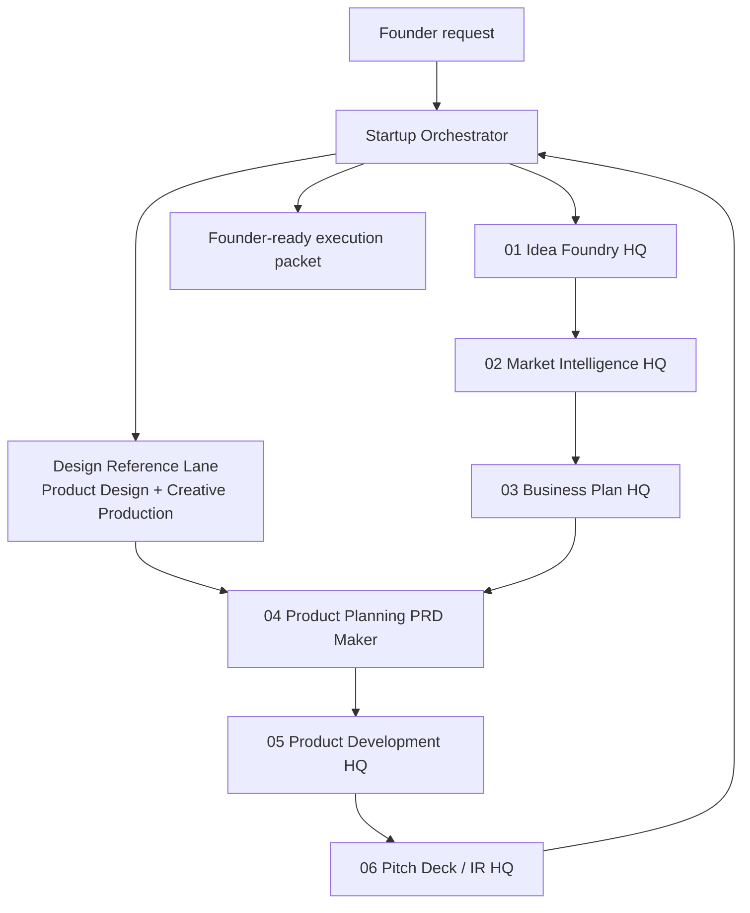

# Orchestration Map

## Language Handling

- English by default.
- Korean response when the founder writes Korean.
- Artifact IDs stay English for portability.

## Evidence Handling

Each HQ must mark claims:

- `source-backed`
- `user-provided`
- `inferred`
- `simulated`
- `needs validation`

## Design Reference Handling

When the founder supplies a reference URL, screenshot, Figma frame, brand asset,
or asks for a visual concept, the Orchestrator routes that input through the
Design Reference Lane before Product Development:

- Product Design confirms the design brief and captures permitted URL or image
  evidence.
- Creative Production explores visual territories when the visual target is not
  fixed yet.
- PRD Maker writes the reference source map into the product `design.md` and
  `wireframes.md`.
- Product Development preserves that design package and verifies the rendered
  result with browser/app evidence.
