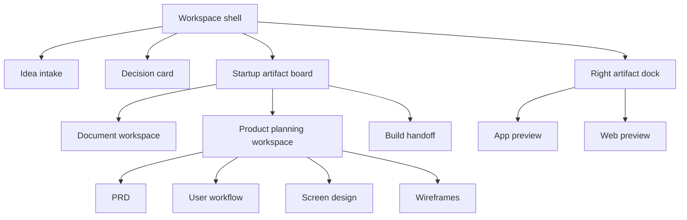

# Design — Startup Studio Web Surface

## Product And Visual Design Source Map

| Source | Permission status | Capture status | Signals to adapt | Avoid |
|---|---|---|---|---|
| REF-001 Linear {#ref-001} | public-reference-only | captured | compact rail, issue/detail density, roadmap/product language | exact brand, exact issue UI, exact copy |
| REF-002 Manyfast {#ref-002} | public-reference-only | captured | Korean idea-to-PRD/wireframe mental model, central input clarity | old manifest framing |
| REF-003 Liner Write {#ref-003} | public-reference-only | captured | research/draft/fact-check/edit document workflow | pure writing landing page |
| REF-004 Sudowrite {#ref-004} | public-reference-only | captured | blank-page relief, draft momentum, rewrite loop | beige fiction-brand visual system |
| REF-005 GPAI {#ref-005} | public-reference-only | captured plus supplied screenshots | left recent-work rail, central answer/doc, right follow-up question | education-only framing |
| REF-006 Sinas {#ref-006} | public-reference-only | captured | dark technical confidence, unified workspace restraint | developer terminal hero |
| REF-007 Genspark {#ref-007} | public-reference-only | blocked visual, positioning only | all-in-one AI workspace promise | use as visual evidence |
| REF-008 Operational dashboard screenshot {#ref-008} | supplied reference | captured as task attachment | status-first sidebar, checklist, right cards | payment-product nouns |

## Selected Direction

Startup Studio should feel like a calm founder operating board. The founder
enters an idea once, then sees that idea become linked startup work:

- customer and problem;
- market and evidence;
- business-plan draft;
- PRD requirements;
- user workflow;
- screen design;
- wireframes;
- app build scope;
- web build scope;
- deck/IR claims.

## Information Architecture

## Component Architecture

### CMP-001: WorkspaceShell {#cmp-001}

- **Purpose:** Hold rail, center canvas, inspector, and responsive shell.
- **Responsibilities:** navigation, layout persistence, theme, current package
  identity.
- **Trade-off:** Dense enough for repeat work; not so dense that first-time
  founders see an enterprise dashboard.
- **Satisfies:** [REQ-001](spec.md#req-001), [REQ-003](spec.md#req-003)

### CMP-002: IdeaSpine {#cmp-002}

- **Purpose:** Preserve the core idea, customer, problem, and current workaround.
- **Responsibilities:** idea input, normalized idea summary, unsupported claim
  labeling.
- **Trade-off:** Keep founder text visible; generated copy must not overwrite it.
- **Satisfies:** [REQ-001](spec.md#req-001), [REQ-002](spec.md#req-002)

### CMP-003: QuestionInspector {#cmp-003}

- **Purpose:** Ask one next question and explain what it unlocks.
- **Responsibilities:** question card, answer control, blocked artifact, evidence
  chips.
- **Trade-off:** Avoid long forms; ask more often only when the previous answer
  visibly changed the package.
- **Satisfies:** [REQ-002](spec.md#req-002)

### CMP-004: ArtifactBoard {#cmp-004}

- **Purpose:** Turn startup artifacts into work items.
- **Responsibilities:** stage grouping, status, evidence, next action, owner.
- **Trade-off:** Use Linear-like density but keep founder language Korean and
  beginner-readable.
- **Satisfies:** [REQ-003](spec.md#req-003)

### CMP-005: DocumentWorkspace {#cmp-005}

- **Purpose:** Draft business plans, support-program documents, and deck copy.
- **Responsibilities:** research, draft, fact-check, edit queue.
- **Trade-off:** Inspired by writing tools, but startup evidence labels remain
  stricter than creative writing assistance.
- **Satisfies:** [REQ-004](spec.md#req-004)

### CMP-006: ProductPlanningWorkspace {#cmp-006}

- **Purpose:** Make PRD work visibly buildable.
- **Responsibilities:** requirements, flow, screen design, wireframes, build gate.
- **Trade-off:** Less freeform document, more traceable work board.
- **Satisfies:** [REQ-005](spec.md#req-005)

### CMP-007: HandoffPacket {#cmp-007}

- **Purpose:** Package the current state for build or next agent execution.
- **Responsibilities:** deterministic packet, clipboard, fallback panel, safety
  filter.
- **Trade-off:** Copy is fastest, but fallback panel is mandatory for browser
  permission failures.
- **Satisfies:** [REQ-006](spec.md#req-006)

### CMP-008: ArtifactDock {#cmp-008}

- **Purpose:** Keep actual app and web preview artifacts visible while the
  founder moves through the lifecycle.
- **Responsibilities:** embedded app preview, embedded web preview, stage status,
  QA visibility.
- **Trade-off:** The dock should prove product work exists without becoming a
  cluttered dashboard.
- **Satisfies:** [REQ-009](spec.md#req-009), [REQ-010](spec.md#req-010)

## Visual System

| Token | Direction |
|---|---|
| Radius | 6-8px for panels and rows; avoid oversized rounded cards |
| Type | compact Korean-readable sans; large type only for workspace title |
| Color | neutral base, dark rail, one accent for active state, evidence colors only when meaningful |
| Density | board rows dense; idea/question areas more spacious |
| Motion | subtle scroll/focus only; no decorative animation |
| Icons | use icons only for navigation/status where they reduce text load |

## Interaction Rules

- Selecting a lifecycle stage moves focus to the most useful next decision.
- The decision card asks one question and shows the blocked artifact it affects.
- The artifact board remains visible and updates for the selected stage.
- The work-bundle copy action opens or copies a structured packet; it never
  silently discards state.
- Changing target output updates board/document/product panes without resetting
  the idea spine.
- Product mode blocks build handoff until PRD, flow, screen, and wireframe links
  exist.
- App mode blocks completion until iOS App Intents and Android QA decisions are
  explicit when applicable.
- Web mode blocks completion until a real preview artifact and browser QA path
  exist.

## External Design Provider MCP {#external-design-provider-mcp}

For the rebuild, Product Development HQ should prefer an external design
provider before coding:

| Provider | Use when | Required proof |
|---|---|---|
| Stitch | Need fast first-pass app screens from the PRD package | provider session, generated screens, desktop/mobile evidence, `REF-GEN-*` |
| Claude Design | Need polished prototype, design-system application, or handoff bundle | provider session or handoff bundle, screen map, desktop/mobile evidence |
| Product Design | Need source capture, image-to-code, audit, or implementation fidelity | captured URL/screenshot/mock, `design-qa.md` |
| Creative Production | Need visual territory before a concrete screen target exists | selected direction and asset manifest |

Provider output is not automatically trusted. It must be:

1. captured as a generated visual source;
2. mapped to requirements, flows, screen specs, and wireframes;
3. checked in browser/mobile viewports;
4. added to design memory only after founder approval.

## Memory Rules {#memory-rules}

Persist only curated decisions:

- selected visual direction;
- accepted target customer/problem;
- approved reference adaptation rules;
- rejected UI directions and why;
- QA lessons from rendered browser checks.

Do not persist:

- raw transcripts;
- credentials;
- private account data;
- local machine paths;
- unrelated runtime logs.

## Build Handoff Constraints

The next builder must not start by polishing the current UI. It must rebuild
against these contracts in order:

1. [spec.md](spec.md)
2. [ux-flow.md](ux-flow.md)
3. [ui-spec.md](ui-spec.md)
4. [wireframes.md](wireframes.md)
5. this visual source map
