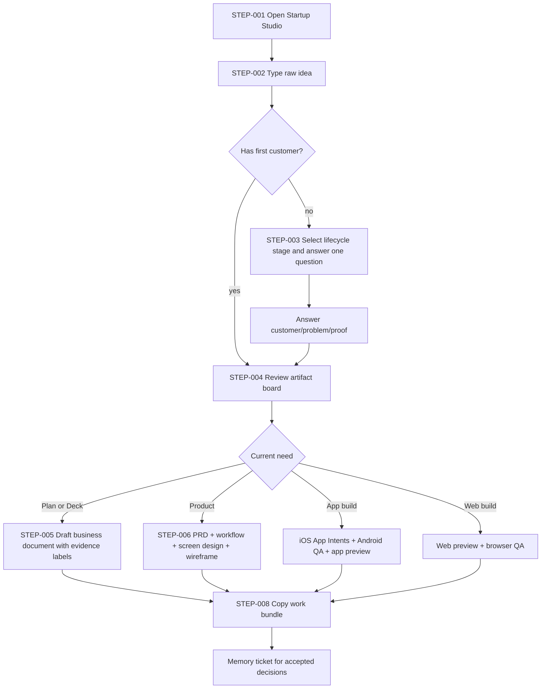
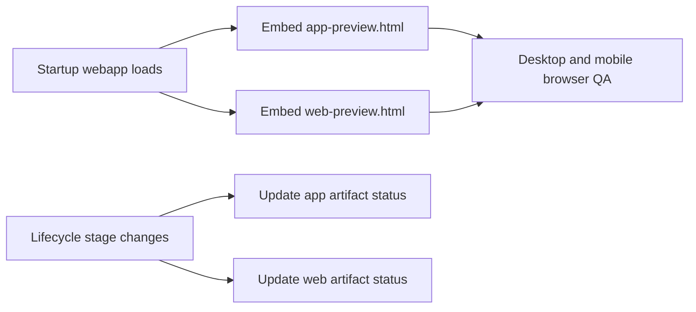
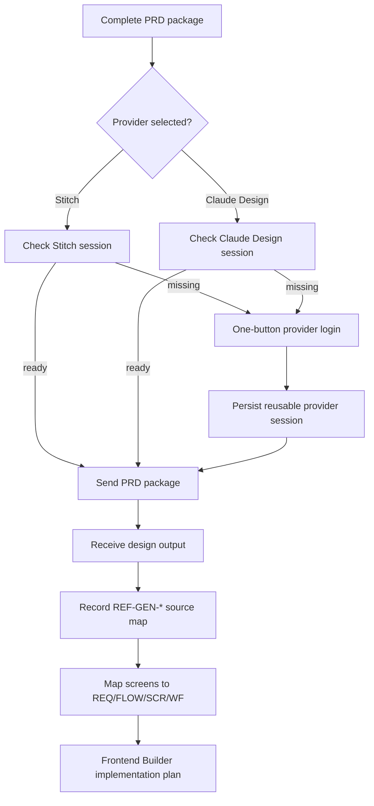
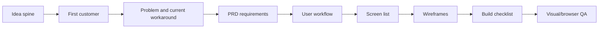
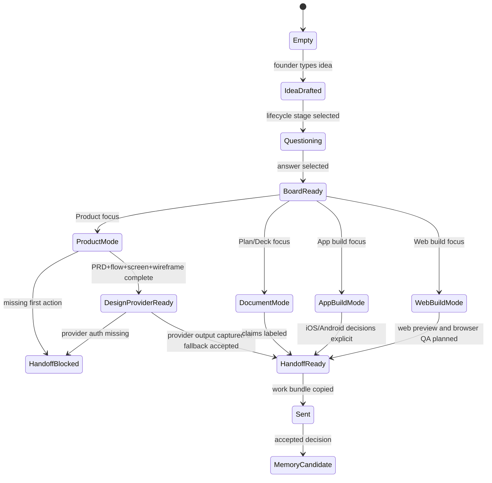

# UX Flow — Startup Studio Web Surface

## North Star Flow

Raw idea -> idea pressure test -> market validation -> business design ->
PRD/screen plan -> app build -> web build -> QA/launch.

The founder should never have to understand internal teams. They should see a
single operating board that progressively turns uncertainty into linked startup
work.

## Flow Index

| Flow | Trigger | Persona | Satisfies | Related screens |
|---|---|---|---|---|
| FLOW-001 Idea capture | page load or empty workspace | Founder | [REQ-001](spec.md#req-001) | [SCR-001](ui-spec.md#scr-001), [WF-001](wireframes.md#wf-001) |
| FLOW-002 Guided question | lifecycle stage change | Founder | [REQ-002](spec.md#req-002) | [SCR-002](ui-spec.md#scr-002), [WF-002](wireframes.md#wf-002) |
| FLOW-003 Artifact board review | workbench review | Founder | [REQ-003](spec.md#req-003) | [SCR-003](ui-spec.md#scr-003), [WF-003](wireframes.md#wf-003) |
| FLOW-004 Document drafting | Plan or Deck focus | Founder | [REQ-004](spec.md#req-004) | [SCR-004](ui-spec.md#scr-004), [WF-004](wireframes.md#wf-004) |
| FLOW-005 Product planning | Product focus | Founder + Builder | [REQ-005](spec.md#req-005) | [SCR-005](ui-spec.md#scr-005), [WF-005](wireframes.md#wf-005) |
| FLOW-006 Build handoff | work bundle copy | Builder agent | [REQ-006](spec.md#req-006) | [SCR-006](ui-spec.md#scr-006), [WF-006](wireframes.md#wf-006) |
| FLOW-007 Memory admission | accepted decision | Memory curator | [REQ-007](spec.md#req-007) | non-visual |
| FLOW-008 Design provider handoff | UI rebuild selected | Builder agent | [REQ-008](spec.md#req-008) | [SCR-007](ui-spec.md#scr-007), [WF-007](wireframes.md#wf-007) |
| FLOW-009 Right artifact dock | page load and stage change | Founder + Builder | [REQ-009](spec.md#req-009) | [SCR-008](ui-spec.md#scr-008), [WF-008](wireframes.md#wf-008) |
| FLOW-010 App/web build lanes | App or Web stage selected | Builder agent | [REQ-010](spec.md#req-010) | [SCR-008](ui-spec.md#scr-008), [WF-008](wireframes.md#wf-008) |

## Journey Map

| Step | User goal | User action | Studio response | Risk | Artifact links |
|---|---|---|---|---|---|
| STEP-001 {#step-001} | Start without setup | Opens workspace | Shows idea input, one next action, no internal labels | blank-page anxiety | [SCR-001](ui-spec.md#scr-001) |
| STEP-002 {#step-002} | Explain the idea | Types raw idea | Creates first artifact preview and marks evidence gaps | fake confidence | [REQ-001](spec.md#req-001) |
| STEP-003 {#step-003} | Narrow the target | Selects a lifecycle stage and answers one question | Updates customer/problem, board rows, document draft, and preview status | too many choices | [REQ-002](spec.md#req-002) |
| STEP-004 {#step-004} | See what exists | Reviews the stage board | Shows artifact board with statuses and next proof | dashboard clutter | [REQ-003](spec.md#req-003) |
| STEP-005 {#step-005} | Prepare documents | Switches focus to Plan or Deck | Shows claim/evidence/edit workspace | unsupported claims | [REQ-004](spec.md#req-004) |
| STEP-006 {#step-006} | Plan the product | Switches focus to Product | Shows PRD, workflow, screens, wireframes, blocked questions | non-buildable PRD | [REQ-005](spec.md#req-005) |
| STEP-007 {#step-007} | Get real design | Chooses Stitch or Claude Design | Opens provider login if needed and sends PRD package | auth or provider output missing | [REQ-008](spec.md#req-008) |
| STEP-008 {#step-008} | Hand off | Copies work bundle | Copies or displays a structured handoff packet | missing clipboard fallback | [REQ-006](spec.md#req-006) |
| STEP-009 {#step-009} | Inspect artifacts | Reviews right dock | Sees actual app and web previews | fake placeholder | [REQ-009](spec.md#req-009) |

## User-Flow Graph {#flow-001}

## Artifact Dock Flow {#flow-009}

## Design Provider Flow {#flow-008}

## Product Planning Flow {#flow-005}

## Service Blueprint

| User layer | Frontstage UI | Agent/package owner | Data/event | Risk |
|---|---|---|---|---|
| Type raw idea | Idea input + starter prompt | Startup Orchestrator | `idea_spine` | Empty input generates fake content |
| Answer question | Active decision card | Idea Foundry / Market Intelligence | `founder_answer` | Questions are too broad |
| Review board | Product-board rows | Startup Orchestrator | `artifact_status[]` | Board lacks real next actions |
| Draft plan | Document workspace | Business Plan HQ / Pitch Deck IR HQ | `claim`, `evidence_state` | Claims appear verified without sources |
| Plan product | PRD workspace | Product Planning PRD Maker | `REQ`, `FLOW`, `SCR`, `WF` | Missing traceability |
| Inspect artifacts | App/web preview dock | Product Development HQ | `artifact_preview[]` | Preview is fake or missing |
| Build handoff | Work bundle copy | Product Development HQ | `handoff_packet` | Clipboard failure or private data leak |
| Persist memory | Memory ticket | PM Soul / Memory Curator | `memory_event` | Transcript dump |

## State Transition

## Drop-Off And Repair Points

| Risk point | User symptom | Repair rule |
|---|---|---|
| Empty first screen | "What do I do?" | One idea input, one primary button, one example |
| Too many artifacts | "This is just a dashboard" | Hide secondary panels until input exists |
| Question fatigue | "Stop interviewing me" | Show one decision at a time and exactly what changes |
| PRD not buildable | "Still no screen" | Product mode always shows screen and wireframe preview |
| Unsupported claims | "Looks made up" | Label `needs evidence`; never show as verified |
| Broken handoff | "Where did this go?" | Show copied packet or fallback panel |

## Links

- Requirements: [spec.md](spec.md)
- Screen design: [ui-spec.md](ui-spec.md)
- Wireframes: [wireframes.md](wireframes.md)
- Visual direction: [design.md](design.md)
